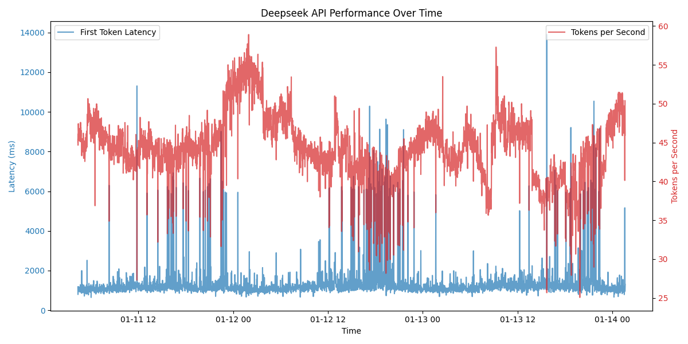

<h1 align="center">📊 Deepseek Performance Monitoring</h1>

<p align="center">
    <a href="https://github.com/tom-doerr/llm_api_testing/stargazers"></a>
    <a href="https://github.com/tom-doerr/llm_api_testing/issues"></a>
    <a href="https://github.com/tom-doerr/llm_api_testing/blob/main/LICENSE"></a>
    <br/>
    <a href="https://github.com/tom-doerr/llm_api_testing/commits/main"></a>
    <a href="https://github.com/tom-doerr/llm_api_testing"></a>
    <a href="https://pypi.org/project/litellm/"></a>
    <a href="https://python.org"></a>
</p>

<p align="center">
    <strong>A performance monitoring solution for Deepseek API using LiteLLM</strong>
</p>

## 📊 Latest Performance Results


## 🚀 Features
- Measures response latency in milliseconds
- Calculates tokens processed per second
- Runs in 1-minute intervals
- Logs results to CSV file
- Runs for 24 hours

## 🛠️ Usage

1. Ensure LiteLLM is installed and configured
2. Set your Deepseek API key as an environment variable:
```bash
export DEEPSEEK_API_KEY='your_api_key_here'
```

3. Run the script:
```bash
python3 deepseek_performance_monitor.py
```

## 📈 Output

The script creates a CSV file `deepseek_performance.csv` with the following columns:
- timestamp: Measurement time
- first_token_latency_ms: Time to first token in milliseconds
- total_latency_ms: Total response time in milliseconds
- tokens_per_second: Tokens processed per second
- completion_tokens: Total tokens in the response (completion tokens)
- prompt_tokens: Number of tokens in the prompt

## 📋 Example Output

### Performance Statistics
```plaintext
Average TPS: 45.96
Max TPS: 47.43
Min TPS: 44.67

Average First Token Latency: 1030.93 ms
Max First Token Latency: 1184.10 ms
Min First Token Latency: 794.79 ms

Average Total Latency: 17826.14 ms
Max Total Latency: 20675.07 ms
Min Total Latency: 14632.69 ms

Total Completion Tokens Processed: 10657
Total Requests: 13
```
```
2025-01-11 04:02:02 - Latency: 1550.53ms, TPS: 9.67, Tokens: 15
2025-01-11 04:03:04 - Latency: 1317.85ms, TPS: 11.38, Tokens: 15
2025-01-11 04:04:05 - Latency: 1375.23ms, TPS: 10.91, Tokens: 15
```

## 📦 Requirements
- Python 3
- LiteLLM
- Deepseek API key

## 📝 Notes
- The script will run for 24 hours unless interrupted
- Errors are logged to console but don't stop execution
- Results are saved to CSV for later analysis
